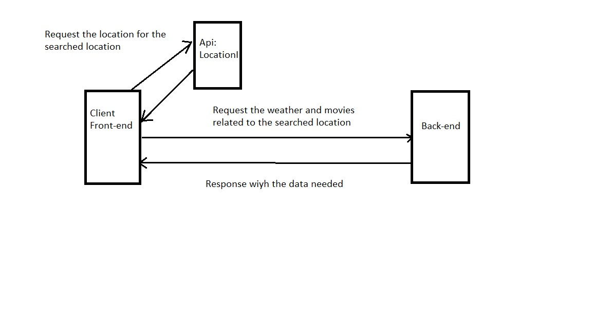

# City Explorer

**Author**: Moayad Alhaj
**Version**: 1.0.0

## Overview

This website allows users to explore any location by typing the location name in the input field and as a result, the Lat and the Long will be displayed with a map of that location and you can zoom in and out.

## Getting Started

Used Libraries
    - React
    - Axios
    - Bootstrap

## Architecture

For the design, I only used Bootstrap library and some CSS.

## Change Log

## Credit and Collaborations

## Request and Response

## Lab06

### 1. Name of feature: find the longitude and latitude of the entering location

Estimate of time needed to complete: 2

Start time: 3:00

Finish time: 5:00

Actual time needed to complete: 2

### 2. Name of feature: render a map of the city

Estimate of time needed to complete: 2

Start time: 5:00

Finish time: 6:30

Actual time needed to complete: 1:30

### 3. Name of feature: Handel Errors in search box

Estimate of time needed to complete: 1:30

Start time: 7:00

Finish time: 8:00

Actual time needed to complete: 1

## Lab-08

### 5. Name of feature: (Front-end) render weather data related to the the searched city

Estimate of time needed to complete: 1

Start time: 7:00

Finish time: 8:00

Actual time needed to complete: 1

### 6. Name of feature: (Front-end) render Movies related to the the searched city

Estimate of time needed to complete: 1:30

Start time: 10

Finish time: 11

Actual time needed to complete: 1
